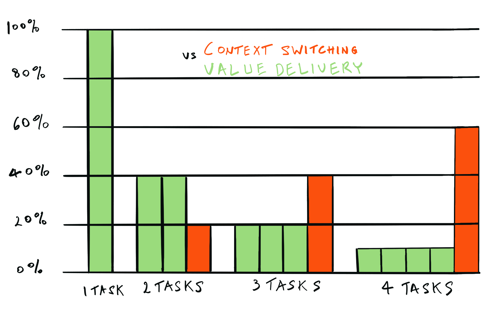

Everybody feels it. As soon as we try to hold two things at once in our mind, discomfort starts building up. We might not notice it immediately, but it's there. The most striking example these past years is texting while driving. But it isn't restricted to such dramatic circumstances, and neither is it restricted to individuals.

Less obvious to most people, but just as damaging is its application to teamwork. That is why [Kanban](/glossary#kanban) has WIP (Work In Progress) Limits, and these are often ported to [Scrum](/glossary#scrum) teams. These are put in place to prevent Teams as a whole to open too many work items in parallel, by setting an explicit maximum number of concurrently open items at any given time. The idea being that once the limit is reached, no new one (of the same category) should be opened before one is closed.

Without these, often, well-meaning team members start working on the next [Sprint Backlog](/glossary#sprint-backlog) item as soon as no further work in their expertise remains on the highest priority item. This induces waste and lack of focus to the team's work.

But more precisely... Why are WIP Limits a good thing?

### **Reducing waste**

As mentioned above, introducing WIP Limits reduces waste. In [Lean](/glossary#lean), tracking and reducing waste are central concepts. One of the sources of waste is inventory: the idea that having (finished or partially finished) product sitting in queues is detrimental to the company's health. Inventory takes up space, and represents unavailable cash.

In the same way, unfinished software represents waste. As code remains partially done (that is unmerged, untested, undeployed,...) it takes energy away from the team without providing value to the company. Unmerged code needs to be re-based (or brought in sync with the progress of the codebase), untested code needs to be fixed to meet quality standards, undeployed code isn't providing anybody any value. The longer the code sits, the colder it will get in the developer's mind, and the costlier it will get to polish for release.

### **Identifying process improvement opportunities**

As the constraint to remain single-mindedly focussed as a group appears, obstacles will surface, that will highlight process inefficiencies. For example, if the [Code Review](/glossary#code-review) process isn't efficient enough, developers will start feeling restless. In the absence of WIP Limits, their natural reaction will be to get started on the next highest priority, in order not to be idle. This goes back to the [Utilisation Maximisation](/glossary#utilisation-maximisation) instinct bred by centuries (well, ok, maybe a bit less) of Taylor-style management. Introducing WIP Limits will force the team to re-assess their [Code Review](/glossary#code-review) process and make it efficient (spoiler: it will become a high priority activity, done with direct communication, instead of relying on communication through tickets or comments and getting around to it when one has a moment to spare).

### **Identifying bottlenecks**

Once the first process inefficiency has been cleared by frustrated team members, others will appear, and WIP Limits will become a driving force to improve the team's system one bottleneck at a time. This is one of the great benefits of WIP Limits: they provide a mechanism to find successive bottlenecks, optimise naturally the workflow, and drive up efficiency.

### **Improving team health**

As good as the team gets at removing bottlenecks in their process, there will always be moments when someone is done, and needs to figure out what to do while their teammate catches up to them. What then? Wouldn't it make sense for them to switch to the next item in the [Sprint](/glossary#sprint)? That would be the natural thing to do, indeed. But what if, instead, this time started being used for often neglected activities, such as code cleaning and other "pebble in the shoe" issues that are often postponed because "we don't have time right now". This is the idea of building [Slack Time](/glossary#slack-time) into the process (another core [Agile](/glossary#agile) concept, often misunderstood or forgotten).

### **Enabling to say No… For Now**

Building [Slack Time](/glossary#slack-time) requires not only that the team practices and respects their WIP Limits faithfully, but that they take ownership of their workload and start being empowered to (temporarily) say no to opening additional [Backlog Items](/glossary#backlog-item). As they define explicitly their WIP Limits and start enforcing them, they will build a clear, transparent reference, with well articulated justification as to why they shouldn't pick additional work... for now.

## **Conclusion**

OK, you might think. I'm sold. Improving Team health, reducing waste for the Company, I want to do that. How should I go about it?

Well, that will be the topic of another post. In that post, I will go over which factors to consider in setting WIP Limits and what to do to apply them effectively.

In the meantime, thanks for reading this far, and if you're not tired of reading yet, check out the references below.

Until next time, good bye :) and stay safe.

## Further information

If your curiosity is piqued and you wish to look further into this topic, I've gathered some information below:

### Articles

[Another overview](http://planview.com/resources/articles/benefits-wip-limits/)

[Wastes specifics](https://www.planview.com/resources/articles/wip-limits/)

### Videos

[3 reasons why](https://youtu.be/CgbM4c8GJa8)

[Factory comparison: ](https://www.youtube.com/watch?v=p-cBY4L_y_s)

[Fun visual example](https://www.youtube.com/watch?v=zEJn6eQO6FE)

### Books

[Agile Estimating and Planning](https://www.amazon.com/Agile-Estimating-Planning-Mike-Cohn/dp/0131479415), p 252-253 (M. Cohn) has a very brief discussion, relating to Flow, Cycle time and progress tracking.
