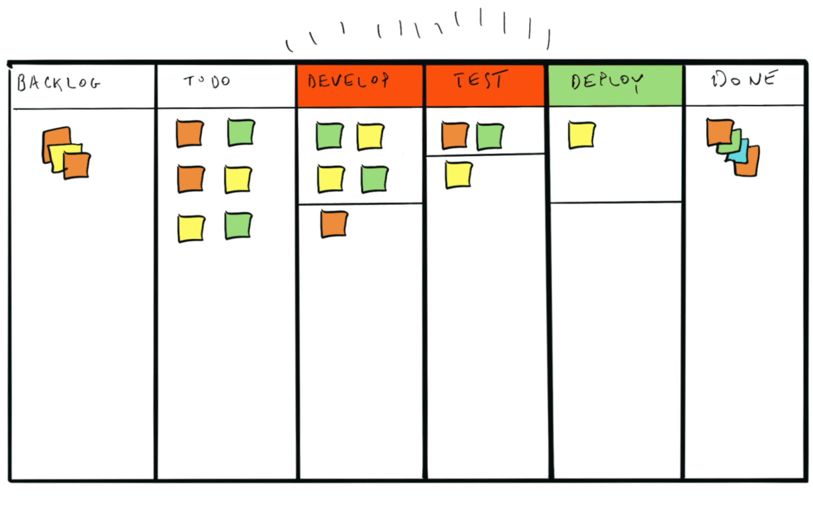

In a [previous article](./why-wip-limits), I left you with good reasons to implement Work in Progress Limits with your team, but no guidance on how to go about it. So, let's talk about that today!

## **OK, you might think. I'm sold.**

Improving Team health, reducing waste for the Company, I do want to do that. How should I go about it?
Well, you've come to the right place: in this post, I will go over some factors to consider when setting WIP Limits and how to apply them effectively.

## **How to find the right Limit ?**

Amongst the factors you will want to consider is the size of the team and the level of collaboration effectiveness (do they pair?, do they already know about swarming?,…). A smaller team that practices regular pair (or even mob) programming sessions will be able to adjust easily to lower WIP Limits than a bigger team, with a lower level of collaboration. [Some](https://www.planview.com/resources/articles/wip-limits/) [references](https://www.youtube.com/watch?v=zEJn6eQO6FE) give rules of thumb for a reasonable starting point. For example, you could use the number of team members plus one. Don't overthink it though, the first attempt is just that: a starting point.

Indeed, in Agile approaches, we put a lot of emphasis on the [Inspect and Adapt](/glossary#inspect-and-adapt) practice, and WIP Limits are no exceptions to that rule. As you and your team grow in experience with WIP Limits, you will be able to try out different values, and see which ones work best for you.

## **How to apply a WIP Limit**

So, don't hesitate to experiment with the value itself, but be disciplined! Once you and your team have agreed on a value to try out, try as rigorously as possible to stick with that number for the whole iteration, and adjust for the next one. However big the temptation, avoid as much as possible to break that rule, and focus instead on _why_ it seems impossible to stick to it, _what_ elements of the process are making it hard. This will lead to identifying inefficiencies in your process, and give you the opportunity to optimise your process, instead of going back to old habits. It will be challenging, but it will yield results. It will also be a great opportunity to practice [Root Cause Analysis](/glossary#root-cause-analysis) skills and facilitation techniques.

## **Use your tools well**

Lastly: leverage your tools as best you can. If the [Agile Manifesto](/glossary#agile-manifesto) places Individuals and Interactions over Processes and Tools, it, in no way, implies that you should ignore the latter.

Most kanban-style task tracking tools (like [Jira](https://www.atlassian.com/agile/kanban/wip-limits) for instance) have the feature to set WIP Limits. Jira allows you to set them per column and will display a warning colour in the column if you reach your Limit.

Additionally, use your tools to investigate and dig into bottlenecks: measure [Cycle and Lead Time](/glossary#cycle-and-lead-time). This is one of the best opportunities to empirically practice the [Inspect and Adapt](/glossary/#inspect-and-adapt) approach of [Agile](/glossary#agile).

## **Conclusion**

In the [first part](./why-wip-limits) of this introduction of Work in Progress Limits, we've seen how restricting and focussing our work, we can reduce waste, and find opportunities to become more efficient, not only individually, but at a Team level.

In this second part, we've now added some practical tips on how to get started by setting a first WIP Limit, then inspecting and adjusting this number.

It might feel uncomfortable at first, but with practice and time, I'm convinced you will find as much value in a focussed workflow as I do :)

Stay tuned by subscribing to the [RSS Feed](/rss.xml) for further content on [Scrum](/glossary#scrum), [Kanban](/glossary#kanban) and all things [Agile](/glossary#agile).

Until next time, keep learning, and stay safe :)

## **Further information:**

If your curiosity is piqued and you wish to look further into this topic, I've gathered some information below:

### **Articles:**

[Some tips](https://www.perforce.com/blog/hns/kanban-wip-limits-5-rules-better-workflows)

[WIP Limits in Jira Kanban boards](https://www.atlassian.com/agile/kanban/wip-limits)

### **Videos:**

[Tools discussion](https://www.youtube.com/watch?v=p-cBY4L_y_s)

[Good explanation of leveraging Jira](https://www.youtube.com/watch?v=zEJn6eQO6FE)

### **Books:**

[Agile Estimating and Planning](https://www.amazon.com/Agile-Estimating-Planning-Mike-Cohn/dp/0131479415), p 252-253 (M. Cohn) has a very brief discussion, relating to Flow, Cycle time and progress tracking.
