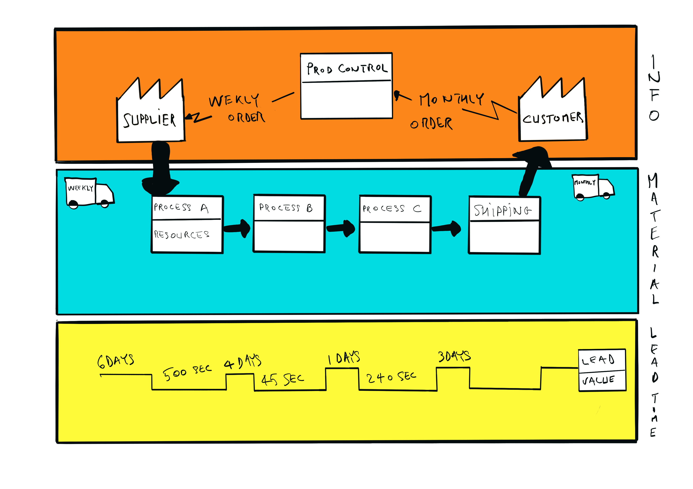

A few days ago, I attended a webinar on Value Stream Mapping.

As a continuous learner, I find it valuable to keep track of what I've understood so far, as well as present some further learning resource. This is what this post is about :-)

## Big Companies are aiming towards Agility too

As [Agilty](/glossary#agility) matures from small teams, early concept validation, and startups to big companies, its transformative nature becomes one of the foremost concerns. How do you get from a traditional silo-prone organisation chart to one inspired by and resembling SAFe or LeSS?

Migrating towards a Scaled Agile company requires cultural changes, of course, but it also demands a clear picture of the starting point, and an idea of the desired destination.

How can you identify these, what tools, practices, exercises are there to help you ?

Well, one of those tools is Value Stream Mapping.

## What is Value Stream Mapping

As many Lean concepts and practices, Value Stream Mapping emerged from the Toyota Production System. It was then further refined and transformed to become an important tool of Lean practitioners' when it comes to understanding the current situation and proposing an improved model for the future.

At its core, it is a method that aims at identifying all the activities, all the processes involved in a company's value creation. It then helps clarify which process elements are value creating, which ones are non-value creating but necessary and finally which ones are non-value creating and no longer necessary, thus identifying waste removal opportunities. Its main result is encapsulated in an artifact called (quite imaginatively) a Value Stream Map.

This map visually represents the current situation, including Information Flows, Material Flows and sometimes a Time Ladder.

## In Agile Software Development

The Value Stream Map that we've seen above, with its Material Flow seems concerned mostly with heavier industries, with production plants, factories and everything these imply logistically. So what applications are there for Value Stream Mapping in Software ?

Most importantly, in Software development, it can help to find inefficiencies in a company's processes. From project inception to their implementation and deployment, especially when it comes to feedback loops and rework linked to delays and wastes.

For instance, one of the best known Scaling Frameworks, SAFe, leverages Value Stream Mapping to design and structure their team groups, known as Agile Release Trains, or ARTs.

In this way, SAFe's ART identification process leverages Value Streams and their Mapping as guides to redesign organisations from speciality focussed silos to multi-disciplinary Value generation focussed Release Trains.

## Summed up

In conclusion, Value Stream Maps are a family of powerful tools enabling the visualisation of the complete process through which a company creates and delivers value to their customers. This map can then be used to identify inefficiencies or waste in the process and guide its improvement.

In order to truly improve a process, it is needed to know exactly what it looks currently like, and to formulate how it should look like in the future. The Value Stream Map will represent the former, and help formulate the latter.

## **Further information:**

If your curiosity is piqued and you wish to look further into this topic, I've gathered some information below:

### Articles:

Clear, pragmatic, well structured introduction centred around the canonical Value Stream Map as a document:

[https://www.plutora.com/blog/value-stream-mapping](https://www.plutora.com/blog/value-stream-mapping)

Lean reference:

[https://www.lean.org/Search/Documents/80.pdf](https://www.lean.org/Search/Documents/80.pdf)

Personable, well narrated case study:

[https://www.joetheitguy.com/case-study-using-value-stream-mapping-service-improvement/](https://www.joetheitguy.com/case-study-using-value-stream-mapping-service-improvement/)

Good overview of what VSM is, and how how to map

[https://tallyfy.com/value-stream-mapping/](https://tallyfy.com/value-stream-mapping/)

In the context of SAFe:

[https://www.scaledagileframework.com/value-streams/](https://www.scaledagileframework.com/value-streams/)

Very complete overview with history, challenges, and some Lean reminders:

[https://www.atlassian.com/continuous-delivery/principles/value-stream-mapping](https://www.atlassian.com/continuous-delivery/principles/value-stream-mapping)

### Videos:

Concise and clear introduction to what a VSM is, somewhat contextualised to SAFe:

[https://www.youtube.com/watch?v=WrPTkJjXrAw](https://www.youtube.com/watch?v=WrPTkJjXrAw)

Full series on the subject

[https://www.youtube.com/watch?v=fkk0hkunfcE](https://www.youtube.com/watch?v=fkk0hkunfcE)

Full webinar (1h30 long)

[https://www.youtube.com/watch?v=5YJYMLaV9Uw](https://www.youtube.com/watch?v=5YJYMLaV9Uw)

### Books:

There are many, many books dedicated specifically to the topic. I haven't yet read any of them, but when the time comes it's likely going to be one of these, based on their good reviews:

[https://www.amazon.com/Value-Stream-Mapping-Organizational-Transformation-ebook/dp/B00EHIEJLM](https://www.amazon.com/Value-Stream-Mapping-Organizational-Transformation-ebook/dp/B00EHIEJLM)

[https://www.amazon.com/Learning-See-Stream-Mapping-Eliminate/dp/0966784308/](https://www.amazon.com/Learning-See-Stream-Mapping-Eliminate/dp/0966784308/)

[https://www.amazon.com/Complete-Lean-Enterprise-Administrative-Processes-ebook-dp-B00UVAQ0DK/dp/B00UVAQ0DK](https://www.amazon.com/Complete-Lean-Enterprise-Administrative-Processes-ebook-dp-B00UVAQ0DK/dp/B00UVAQ0DK)
