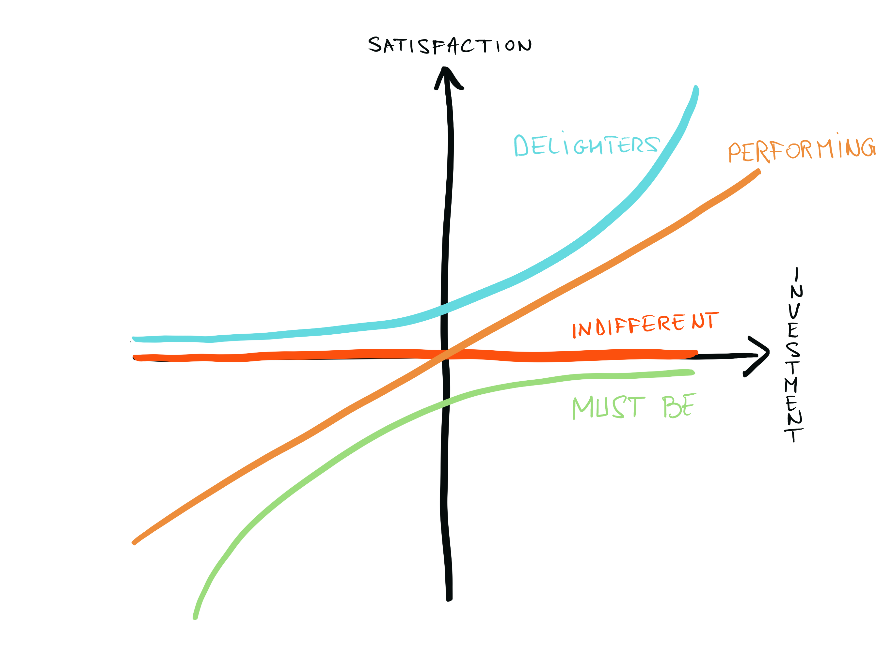
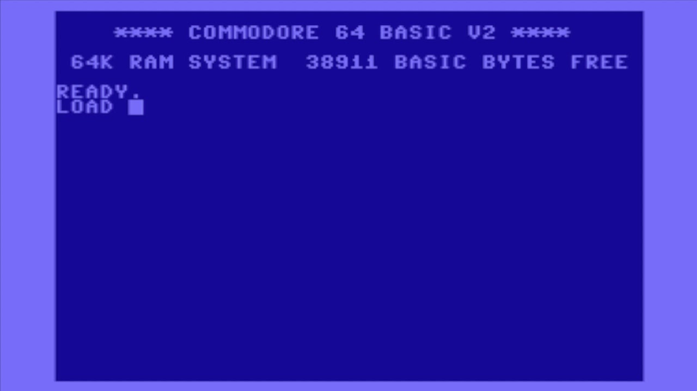

In a past assignment, the business stakeholders had previously used a "Version 1, Version 2, Version 3" approach to prioritisation. Budget constraints and a very Project focussed approach to budgeting (as opposed to Product focussed) had driven a rescheduling of versions. Understandably, the stakeholders had grown weary of this approach to planning when "Later" turned into "Never" in their view. It made features prioritisation difficult, since all features were now seen as highest importance.

In order to get the backlog to a healthy, manageable state, a change of perspective was required. The solution came by introducing the Kano Model, and reframing the discussion in terms of the User's perception. This enabled the Business Stakeholder and the Product Owner to get passed their previous experience, and improved clarity as to how priorities should be set.

## The Origin

Invented by Dr N. Kano at the Tokyo University of Sciences in 1984, the model refocusses the understanding of the Product from a set of features to ways of generating User satisfaction. Through this, it enables prioritisation of upcoming features and gives insight and clarity into how to bring Users satisfaction. Beyond that, it also shows what features will bring delight and differentiate the product positively from its competition.

## Data driven

By measuring User satisfaction through questionnaires and ranking features according to two dimensions (self-explanatory Satisfaction and Investment, or degree of implementation sophistication), the Kano Model defines categories to sort features.

## Categories

The **Performant** o**r Satisfier** category is the easiest to understand and matches the behaviour intuitively expected. It is the type of feature where satisfaction will rise proportionally to the level of implementation of the feature. A classical example would be the gas mileage in a car. The satisfaction of a car owner will increase as the feature improves.

The **Basic Expectation** or **Must Be** category defines the baseline expectations for this type of products. Users won't notice if present, as the features are taken for granted, but will be frustrated if absent. For instance, making voice calls for a smart phone. This rule can be broken, but it takes a lot to get away with it. Apple has resisted for many years adding a second button to their mouse, for instance.

The **Delighter** or **Excitement** category is the one where differentiation and unique selling points appear. This is the one where the Product will be able to bring Users from being satisfied to being delighted. The Touch UI on early smart phones, the universally composable nature of LEGO come to mind.

The **Reverse** category is the opposite of the **Performant**, it is the type of features that annoy the User the more they are present. For instance, queuing at the entrance of a venue: customer frustration will rise with their length.

Last, but not least, the **Indifferent** features are the ones about which the User won't care one way or another. These investments should be avoided or minimised, and represent safe cost cutting opportunities. An example would be the the gas mileage of planes for an airline, or the type of electric cables used inside an appliance.

## Category Migration

As you might have already noticed, some of the examples I used no longer hold true. This is due to the evolutionary nature of User's perceptions. For example, when the early personal computers appeared, they only supported a text interface.

Above, some nostalgia for those of you old enough to remember ;-) That should give you a ballpark to guess my age.

But a few years later, the first Graphical User Interfaces was introduced, and revolutionised the industry. Nowadays, almost no-one but the geekiest would consider using text input as their main way of interacting with a computer. The GUI has moved from **Delighter** to **Must Be**. Similarly, once completely indifferent, the gas consumption of airlines is coming into focus more and more with the rise of traveler's environmental concerns. What was an **Indifferent** aspect is nowadays migrating to the **Reverse** category.

## Conclusion

In essence, the Kano model gives an approach to identify the features that will offer the best return on investment for the Product, and provide another valuable tool to the Product Management community. I hope you now have a clear(er) idea of what it is, what its categories mean and what value it can provide to the Product Backlog clarity.

There is more to say about the topic, but I feel this already provides a good overview of the Model. I will certainly revisit the topic in a later instalment, for example to dive deeper in some of the practical aspects, such as how data is gathered. If you have additional questions or suggestions, feel free to leave a comment bellow :-)

Thank you for your time, I hope you enjoyed reading this as much as I did writing it :-)

If you are interested in more articles like this and wish to be notified of new publications, please subscribe to my [RSS Feed](/rss.xml).

## **Further information:**

If your curiosity is piqued and you wish to look further into this topic, I've gathered some information below:

### Articles:

A very complete overview

[https://foldingburritos.com/kano-model/](https://foldingburritos.com/kano-model/)

Onother clear overview:

[https://www.mindtools.com/pages/article/newCT_97.htm](https://www.mindtools.com/pages/article/newCT_97.htm)

Strengths, weaknesses and tips for applying

[https://sapioresearch.com/kano-analysis](https://sapioresearch.com/kano-analysis)

### Medium

Experience in applying and lessons learned:

[https://medium.com/design-ibm/kano-model-ways-to-use-it-and-not-use-it-1d205a9cf808](https://medium.com/design-ibm/kano-model-ways-to-use-it-and-not-use-it-1d205a9cf808)

[https://medium.com/@solmesz/kano-model-product-design-and-startups-a-powerful-combination-61eacf1a6f30](https://medium.com/@solmesz/kano-model-product-design-and-startups-a-powerful-combination-61eacf1a6f30)

### Books

Agile estimating and planning p.121 (M. Cohn)

[https://www.amazon.com/Agile-Estimating-Planning-Mike-Cohn/dp/0131479415](https://www.amazon.com/Agile-Estimating-Planning-Mike-Cohn/dp/0131479415)
